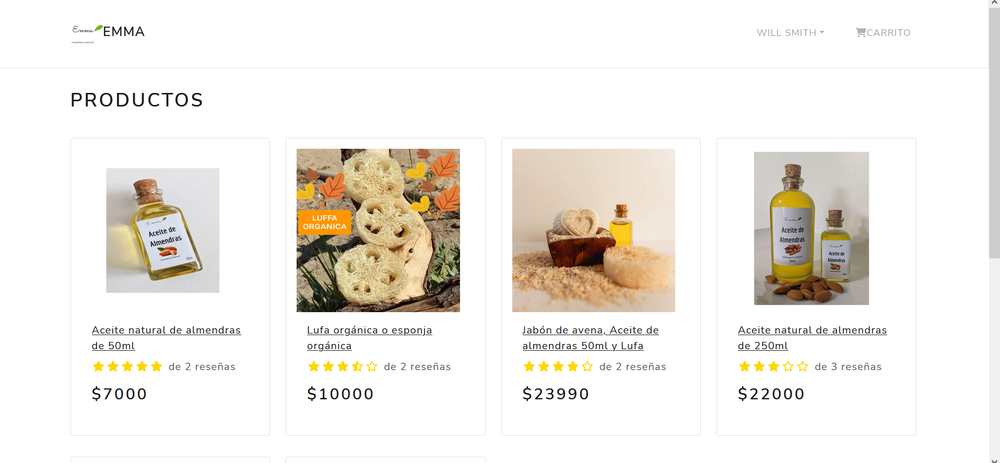
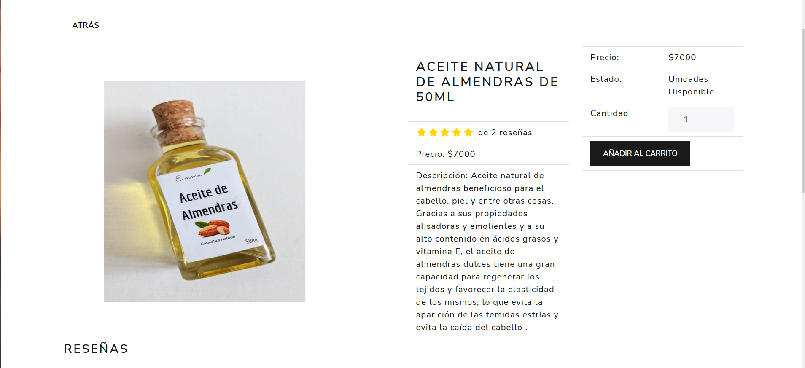
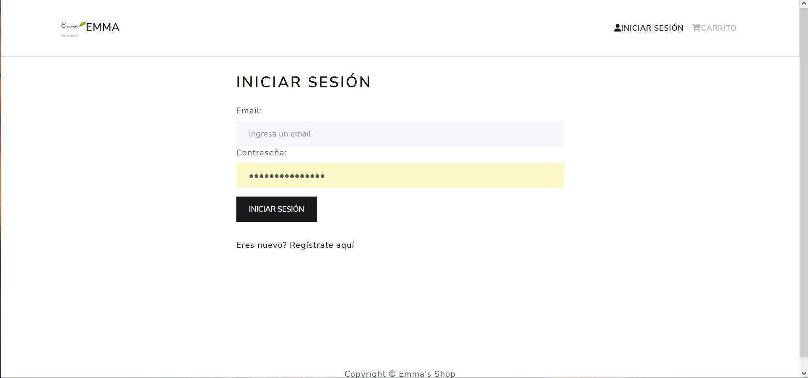

# Almond-Web-Project
Proyecto personal para Coding Dojo. 

Página e-commerce sobre aceites naturales y cosmética natural. Se utilizó React, Redux, React Boostrap, CSS, HTML, MongoDB, MongoAtlas, Express, Nodejs.

:point_right: [Live preview](http://34.234.77.210/)

Imagen 1:


Imagen 2:


## Pequeño bug que no he podido solucionar aún
Cuando inicias sesión deberia redirigir al home page pero no lo hace, deberás hacerlo manual con f5 y también cuando te registras deberás hacer lo mismo e ir a la página principal dandole al logo.



## Como correr?

-   [ ]  En la base del proyecto crea un archivo .env con los siguiente:

```
NODE_ENV = development
PORT = 8000
MONGO_URI = (Link de la db que debes crear en MongoAtlas)
JWT_SECRET = abc123
PAYPAL_CLIENT_ID = (ID que se consigue en el sandbox de PayPal => https://developer.paypal.com/home)

```
-   [ ]  En la carpeta base correspondiente al servidor corre:

```
npm i 
```

-   [ ] Luego ingresa a la carpeta cliente y corre
```
npm i
```

-   [ ] Iniciar el servidor con

```
nodemon server.js
```

-   [ ]  Iniciar el cliente desde su carpeta
```
npm run start 
``` 
